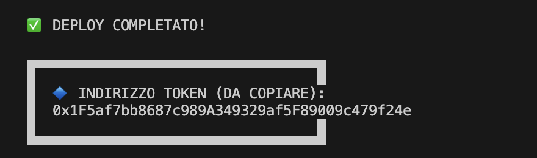

# Manuale

[Link to final report](https://www.overleaf.com/read/mdhwjpjjhsgc#758340)

## Requisiti di sistema
- Docker [get-docker](https://docs.docker.com/get-docker)
- at least 2GB of free space on disk
- at least 8GB of RAM

### Requisiti di sistema per utente finale
- Docker [get-docker](https://docs.docker.com/get-docker)
- Metmask estensione per browser [ink1](), [link2]()
- node v22.16.0^
- npm 11.3.0^
- conoscenza base di configurazioni e variabili di ambiente

## Istruzioni d'uso semplificate per l'utente finale
con node installato:

1. Entrare nella cartella Project
2. sul terminale lanciare il comando `node launcher.js`
3. accedere al programma via [http:/localhost:5173/](http:/localhost:5173/)

oppure:

per Windows
1. Entrare nella cartella Project
2. `Set-ExecutionPolicy -ExecutionPolicy RemoteSigned -Scope CurrentUser`
3. `./launcher.ps1` 

per Unix
1. Entrare nella cartella Project
2. `chmod +x launcher.sh`
3. `./launcher.sh`

## Istruzioni d'uso approfondite per developers
0. Creare i file .env nelle stesse cartelle dei file `.env.placeholder` e inserire le proprie variabili di ambiente e i secret necessari

1. Avviare docker compose, su terminale per avviare la rete Besu e il database MySQL

     `cd Project; cd Besu; docker compose up --build; cd ..`

2. Avviare scripts su terminale per deploy smart contract. Questo passaggio mandata una transazione sulla rete Besu

    `cd Project; cd hardhat; npx hardhat run deploy/deploy.js --network besu; cd ..`

3. Avviare script su terminale per avviare sia client che server

   `cd client; npm run preview`
   in un secondo terminale
   `cd server; npm run start`

## Getting started
### Configurazione Metamask
1. Installare l'estensione di Metamask sul browser [download](https://metamask.io/download)
2. Aggiungere rete custom http://localhost:8545
3. Inserire nel campo chain_id il valore 1338
4. Importare il token nella rete con il simbolo CO2
5. Inserire nel campo indirizzo contratto il valore presente nei log dello script di installazione

### Introduzione

1. Scrivere http://localhost:5173 sul browser
2. Registrarsi cliccando il bottone opportuno
3. Inserire i propri dati personali
4. Inserire il codice seriale ricevuto
5. Inserire le proprie credenziali di accesso nella pagina login
6. Inserire il codice OTP ricevuto sulla mail fittizia (console del browser)

### Vedere il proprio saldo
1. Dopo aver fatto il login si viene reindirizzati nella propria area personale.
2. Si vedono il proprio saldo
3. Si vedono le dichiarazioni di emissioni precedenti
4. Si vedono gli utenti in debito

### Inviare una dichiarazione di emissioni
1. Cliccare sul bottone `credit issuing`
2. Inserire la quantità di emissioni da dichiarare

### Visualizzare storico emissioni
1. CLiccare usl bottone `emissions log`

### Visualizzare storico scambio crediti
1. CLiccare usl bottone `transactions log`

### Inviare dei crediti ad un altro utente
1. Cliccare sull'utente in debito
2. Selezionare la quantità
3. Confermare operaione su Metamask

